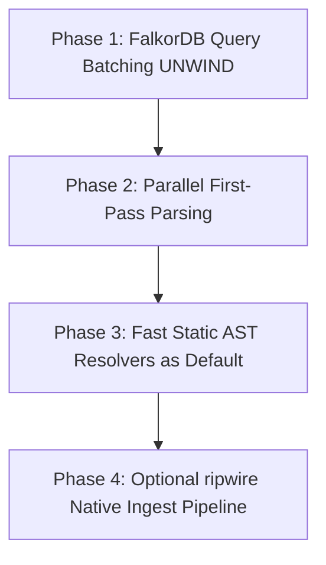

# Code-Graph Performance Acceleration Plan

## 1. Executive Summary

This document outlines the performance bottlenecks identified in `code-graph` during indexing and query operations, analyzes high-performance architectural patterns from `ripwire` (located in [`./ripwire`](ripwire/README.md)), and provides a concrete 4-phase implementation roadmap to accelerate `code-graph` indexing by 10x–50x.

---

## 2. Bottleneck Analysis

Profiling and analyzing [`api/analyzers/source_analyzer.py`](api/analyzers/source_analyzer.py) and [`api/graph.py`](api/graph.py) highlighted three major bottlenecks:

### 2.1 N+1 FalkorDB Query Round-Trips
- **Single-Node Ingestion:** In [`SourceAnalyzer.first_pass`](api/analyzers/source_analyzer.py:83), every class, function, and file entity is created via an individual synchronous FalkorDB query ([`Graph.add_entity`](api/graph.py:357) and [`Graph.add_file`](api/graph.py:507)).
- **Single-Edge Linking:** In [`SourceAnalyzer.second_pass`](api/analyzers/source_analyzer.py:295), every resolved symbol relationship (`CALLS`, `EXTENDS`, `IMPLEMENTS`, `RETURNS`, `PARAMETERS`, `IMPORTS`) triggers an individual `MERGE (src)-[e:...]->(dest)` query via [`Graph.connect_entities`](api/graph.py:584).
- **Impact:** A codebase with 5,000 symbols and 15,000 links results in 20,000+ separate TCP transactions, query parsing overheads, and index lookups in FalkorDB.

### 2.2 Synchronous Single-Threaded First Pass
- AST parsing using tree-sitter in [`SourceAnalyzer.first_pass`](api/analyzers/source_analyzer.py:97) runs strictly sequentially in Python on a single thread.

### 2.3 Heavy LSP Bootstrapping & Dependency Resolution
- For Python projects, [`PythonAnalyzer.add_dependencies`](api/analyzers/python/analyzer.py:73) defaults to creating virtual environments and installing packages via poetry/pip to feed `multilspy` Language Server instances.
- LSP IPC (`request_definition`) across language servers is synchronous and process-bound.

---

## 3. Lessons & Architecture from `ripwire`

[`ripwire`](ripwire/README.md) achieves sub-second indexing (0.25s cold, ~30ms warm) by utilizing:

1. **Parallel Parse Pool:** Parallelizing file ingestion using tree-sitter across all CPU cores with deterministic, sorted file pipelines ([`ripwire/src/ingest_parsepool.h`](ripwire/src/ingest_parsepool.h)).
2. **Selective Query Prewarming:** Compiling AST queries (`tags.scm`) only for languages detected during the file crawl ([`ripwire/bench/PROFILE.md`](ripwire/bench/PROFILE.md)).
3. **In-Memory CSR Graphs:** Maintaining symbol definitions and relationships in-memory using Compressed Sparse Row (CSR) structures rather than incurring round-trip database queries during resolution.
4. **Batched OpenCypher Streaming:** Exporting graph structures as bulk Cypher batches ([`ripwire/src/cypherexport.h`](ripwire/src/cypherexport.h) / `ripwire . --export=cypher`) for fast streaming into FalkorDB.

---

## 4. Implementation Roadmap



### Phase 1: FalkorDB UNWIND Batching (High Impact, Low Risk)
Batch entity and edge creation into chunks (e.g., 500–1,000 items per Cypher query) using `UNWIND`.

- **Batch Node Insertion in [`api/graph.py`](api/graph.py):**
  ```cypher
  UNWIND $batch AS item
  MERGE (c:Searchable {name: item.name, path: item.path, src_start: item.src_start, src_end: item.src_end})
  SET c += item.props, c.doc = item.doc
  RETURN id(c) AS id, item.temp_id AS temp_id
  ```
- **Batch Edge Insertion in [`api/graph.py`](api/graph.py):**
  ```cypher
  UNWIND $edges AS edge
  MATCH (src), (dest)
  WHERE ID(src) = edge.src_id AND ID(dest) = edge.dest_id
  MERGE (src)-[e:CALLS]->(dest)
  SET e += edge.props
  ```

### Phase 2: Parallel First-Pass AST Extraction
- Update [`SourceAnalyzer.first_pass`](api/analyzers/source_analyzer.py:83) to process file reads and tree-sitter AST walks in parallel using `concurrent.futures.ProcessPoolExecutor` or `ThreadPoolExecutor`.
- Return in-memory entity nodes and perform batch writes to FalkorDB on the orchestrator thread.

### Phase 3: Fast Static AST Resolvers as Default
- Make the static tree-sitter resolver ([`TreeSitterPythonResolver`](api/analyzers/python/ts_resolver.py:191)) the default resolution engine (`CODE_GRAPH_PY_RESOLVER=tree_sitter` by default).
- Skip heavy venv creation and dependency installations when static resolution is active.
- Expand lightweight AST-based static resolvers to JavaScript/TypeScript and Java.

### Phase 4: Optional Native `ripwire` Ingest Pipeline
- Support direct ingest acceleration by integrating `ripwire --export=cypher` via [`api/project.py`](api/project.py) when `ripwire` is present in the runtime environment.
- Stream generated Cypher statements directly into FalkorDB via batch pipes.

---

## 5. Verification & Benchmarking

- **Regression Testing:** Run `pytest tests/` to verify graph schema compatibility, node/edge counts, and search correctness.
- **Performance Benchmarks:** Measure wall-clock time on standard repositories (e.g., this repository, Django, Webpack) before and after each phase.
